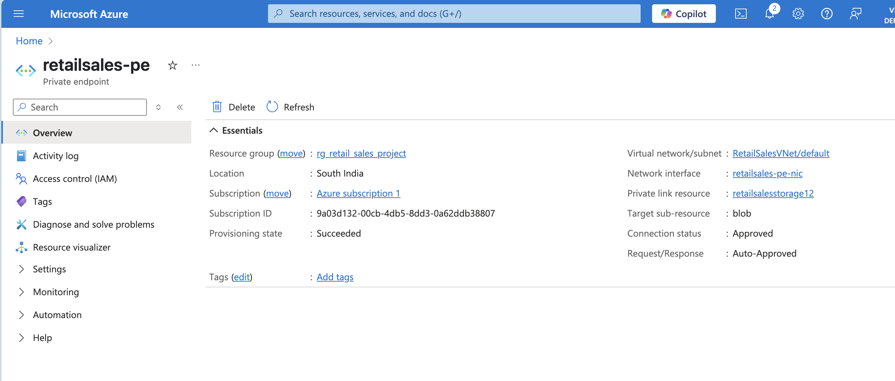
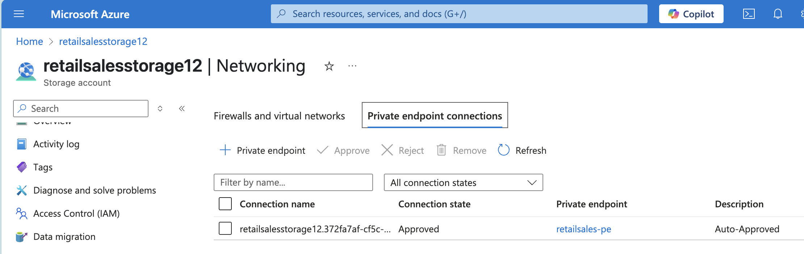

# Retail Sales Insights Pipeline

This is an end-to-end Azure Data Engineering project that ingests, processes, and visualizes global retail sales data using Microsoft Azure services.

## 🔧 Tools Used
- Azure Data Factory
- Azure Data Lake Storage Gen2
- Azure Databricks (PySpark)
- Delta Lake
- Power BI (or Microsoft Fabric)

## 📦 Pipeline Overview
1. Ingest raw CSV data via ADF into Blob Storage
2. Transform and enrich data using Databricks and PySpark
3. Store curated data in Delta Lake
4. Connect to Power BI and create sales insights dashboards

## 📁 Folder Structure
- `data_ingestion/`: ADF pipeline JSON exports
- `notebooks/`: PySpark transformation code
- `powerbi/`: Dashboard files
- `data_lake/`: Raw and processed sample data
- `docs/`: Architecture diagrams and project planning

## ✅ Status
- [x] Repo created
- [ ] Data ingested with ADF
- [ ] Transformations complete in Databricks
- [ ] Power BI dashboard ready

## 🔐 Networking: Private Endpoint Demo

This project uses a Private Endpoint for secure connectivity between Azure services and Blob Storage. The endpoint ensures that no traffic goes over the public internet, simulating an enterprise-grade deployment architecture.

- VNet: `RetailSalesVNet`
- Subnet: `data-subnet`
- Resource: Azure Blob Storage

- ## 🔐 Networking & Security: Private Endpoint Setup

To demonstrate secure enterprise deployment, this project uses a **Private Endpoint** to restrict access to the Azure Storage Account. Public access is disabled, and all blob traffic flows securely through a Virtual Network.

- **Storage Account**: `retailsalesstorage`
- **VNet**: `RetailSalesVNet`
- **Private Endpoint Name**: `retailsales-pe`
- **Target**: Blob Storage
- **Public Network Access**: Disabled

## 🔐 Networking & Security: Enterprise-grade ADF Access

This project uses a **Managed Virtual Network Integration Runtime (IR)** within Azure Data Factory and **System Assigned Managed Identity (MSI)** to securely connect to Azure Blob Storage over a **Private Endpoint**.

- 🔒 No public access to storage account
- 🔐 No keys or secrets used — all access is identity-based
- ✅ Follows Microsoft’s recommended architecture for secure data pipelines

### Tools Used:
- Azure Data Factory (Managed VNet enabled)
- Azure Blob Storage (with Private Endpoint)
- System Assigned Managed Identity

